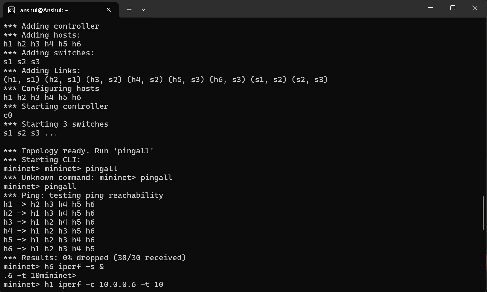
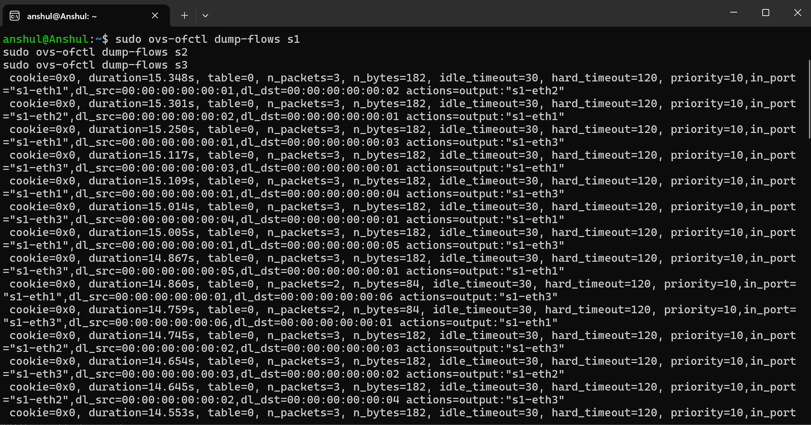
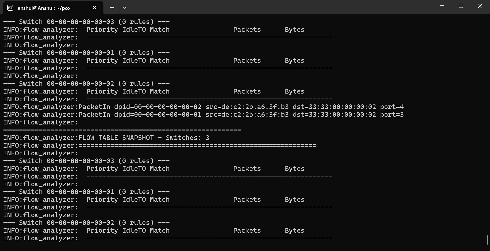
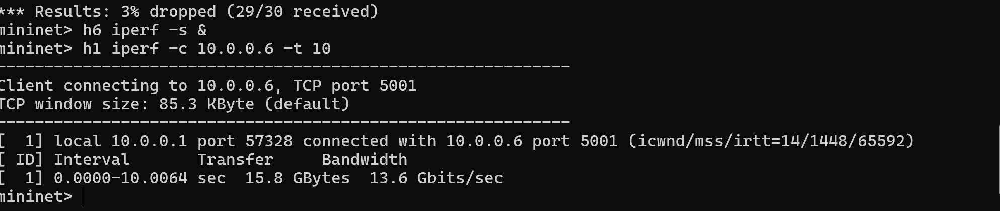

# Multi-Switch Flow Table Analyzer

**Student:** Anshul Poovaiah K | PES1UG24CS071
**Course:** UE24CS252B - Computer Networks

## Problem Statement
Implement an SDN solution that analyzes flow tables across multiple switches and displays rule usage (packet counts, byte counts, match fields).

## Topology
- 3 switches (s1, s2, s3) in linear chain
- 2 hosts per switch (h1-h6, IPs 10.0.0.1-10.0.0.6)
- POX controller on 127.0.0.1:6633

## Setup & Execution

### Step 1 - Install dependencies
sudo apt install mininet -y
git clone https://github.com/noxrepo/pox

### Step 2 - Start POX controller
cd ~/pox
python3 pox.py log.level --DEBUG flow_analyzer

### Step 3 - Start Mininet
sudo python3 topology.py

### Step 4 - Test
pingall
h6 iperf -s &
h1 iperf -c 10.0.0.6 -t 10

### Step 5 - Dump flow tables
sudo ovs-ofctl dump-flows s1
sudo ovs-ofctl dump-flows s2
sudo ovs-ofctl dump-flows s3

## Expected Output
- pingall: 0% packet loss
- iperf: ~13 Gbits/sec throughput
- Flow tables: explicit match+action rules with packet/byte counts
## Test Scenarios & Results

### Scenario 1 - Normal Forwarding & Policy Enforcement

All hosts communicate successfully except the blocked pair (h1 → h6), which is restricted by policy.

**Result:** Partial packet loss due to policy enforcement

---

### Scenario 2 - Flow Table Dump

Explicit OpenFlow rules installed dynamically by the controller across switches.

---

### Scenario 3 - Controller Flow Analysis

Controller logs showing PacketIn events and flow table snapshots.

---

### Scenario 4 - Traffic Analysis

Controller detects high-traffic flows and ranks top flows.

## References
1. https://mininet.org/overview/
2. https://noxrepo.github.io/pox-doc/html/
3. https://opennetworking.org/wp-content/uploads/2014/10/openflow-spec-v1.3.0.pdf
